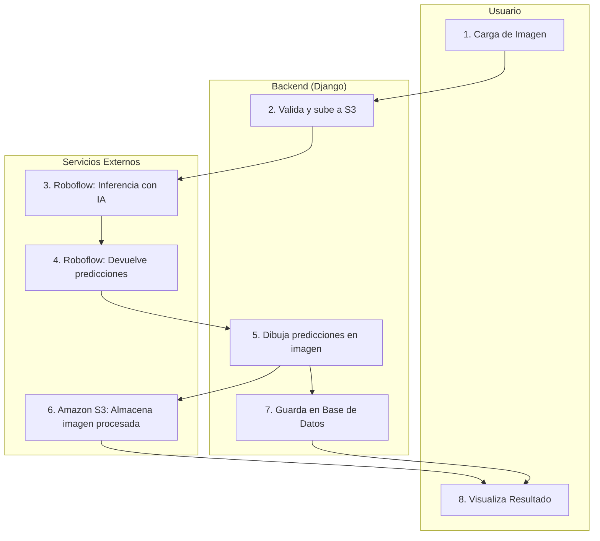

# Sistema de Detección de Hernias mediante Análisis de Imágenes

Este proyecto es una aplicación web desarrollada con Django, diseñada para asistir en el diagnóstico de hernias discales a través del análisis de imágenes médicas. La plataforma permite a los usuarios registrados (médicos) subir imágenes, las cuales son procesadas por un **modelo de inteligencia artificial (YOLO)** para detectar la presencia de hernias, generar un historial clínico y exportar informes en formato PDF.

## Características Principales

- **Autenticación de Usuarios:** Sistema completo de registro, inicio de sesión, cierre de sesión y recuperación de contraseña.
- **Gestión de Perfil:** Los usuarios pueden ver y actualizar la información de su perfil.
- **Análisis de Imágenes:** Carga de imágenes médicas para ser analizadas por un modelo de inferencia (YOLO) alojado en Roboflow.
- **Visualización de Resultados:** Muestra la imagen procesada con las predicciones (segmentación y clasificación) y el nivel de confianza del diagnóstico.
- **Historial Médico:**
    - **Historial Personal:** Cada usuario tiene acceso a un historial de los análisis que ha realizado.
    - **Historial General:** Los administradores pueden visualizar un historial completo de todos los análisis realizados en la plataforma.
    - **Gestión de Registros:** Permite eliminar registros del historial.
- **Generación de Informes PDF:**
    - **Informe Individual:** Genera un informe radiológico detallado para un análisis específico.
    - **Informe General:** Genera un documento PDF con el historial completo (filtrado por usuario o general para administradores).
- **Almacenamiento en la Nube:** Integración con Amazon S3 para el almacenamiento seguro y escalable de las imágenes.

## Flujo del Proceso de Análisis

1.  **Carga de Imagen:** Un usuario autenticado sube una imagen médica a través de un formulario web.
2.  **Validación y Almacenamiento:** El backend de Django valida el archivo (formato, tamaño) y lo sube de forma segura a un bucket de Amazon S3.
3.  **Inferencia con IA:** El sistema envía la URL de la imagen al servicio de Roboflow, que ejecuta un modelo de detección de objetos (tipo YOLO) para analizarla.
4.  **Recepción de Resultados:** Roboflow devuelve las predicciones, que incluyen la clase detectada (ej. "Hernia"), el nivel de confianza y las coordenadas del área de interés.
5.  **Procesamiento Visual:** El backend utiliza OpenCV para dibujar las predicciones (polígonos y etiquetas) sobre la imagen original.
6.  **Actualización de Almacenamiento:** La imagen procesada con las marcas visuales se guarda de nuevo en Amazon S3.
7.  **Creación de Historial:** Se crea un registro en la base de datos con toda la información del análisis: usuario, paciente, diagnóstico, confianza y la URL de la imagen procesada.
8.  **Visualización para el Usuario:** El usuario es redirigido a una página de resultados donde puede ver la imagen analizada y el diagnóstico final.

<p align="center">

</p>

## Tecnologías Utilizadas

### Backend
- **Framework:** Django
- **Lenguaje:** Python 3
- **Base de Datos:** PostgreSQL
- **Servidor ASGI/WSGI:** Gunicorn/Daphne (recomendado para producción)

### Frontend
- **Lenguajes:** HTML, CSS, JavaScript
- **Framework CSS:** Tailwind CSS (inferido por las clases en los archivos JS)

### Servicios Externos y APIs
- **Inferencia de IA:** [Roboflow](https://roboflow.com/) para el alojamiento y ejecución del modelo YOLO.
- **Almacenamiento de Archivos:** Amazon Web Services (AWS) S3.
- **Envío de Correos:** SMTP de Gmail para notificaciones (ej. restablecimiento de contraseña).

### Librerías Clave de Python
- `django`: Framework web.
- `psycopg2-binary`: Adaptador de PostgreSQL para Python.
- `Pillow`: Procesamiento de imágenes.
- `opencv-python-headless`: Manipulación de imágenes y dibujo de predicciones.
- `inference-sdk`: Cliente para la API de Roboflow.
- `django-storages` & `boto3`: Integración con AWS S3.
- `python-dotenv` & `python-decouple`: Gestión de variables de entorno.
- `pytz`: Manejo de zonas horarias.
- `reportlab`: Generación de documentos PDF.

## Configuración e Instalación

Sigue estos pasos para configurar el entorno de desarrollo local.

### 1. Prerrequisitos
- Python 3.8 o superior
- Pip y virtualenv
- PostgreSQL instalado y en ejecución.

### 2. Clonar el Repositorio
```bash
git clone https://github.com/tu-usuario/tu-repositorio.git
cd proy_medicinea_ctual
```

### 3. Configurar el Entorno Virtual e Instalar Dependencias
Se recomienda crear un archivo `requirements.txt` con las dependencias del proyecto.

```bash
# Crear y activar el entorno virtual
python -m venv ent_med
source ent_med/bin/activate  # En Windows: ent_med\Scripts\activate

# Instalar dependencias (asumiendo que existe un requirements.txt)
pip install -r requirements.txt
```

### 4. Configurar la Base de Datos
1.  Crea una base de datos en PostgreSQL para el proyecto.
    ```sql
    CREATE DATABASE "Proy_Med";
    ```
2.  Asegúrate de que las credenciales en `proy_medical/settings.py` coincidan con tu configuración de PostgreSQL.

### 5. Variables de Entorno
Crea un archivo `.env` en la raíz del proyecto con las siguientes variables:

```env
# Clave secreta de Django (generar una nueva para producción)
SECRET_KEY='django-insecure-lf+4rw$t9bm$od010h(n(dhv_bhgj$y&!zjm2=kln1h))8p$sa'

# Configuración de Roboflow
ROBOFLOW_API_KEY='TU_API_KEY_DE_ROBOFLOW'

# Configuración de AWS S3
AWS_ACCESS_KEY_ID='TU_AWS_ACCESS_KEY_ID'
AWS_SECRET_ACCESS_KEY='TU_AWS_SECRET_ACCESS_KEY'
AWS_STORAGE_BUCKET_NAME='bucket-hernia-s3'
AWS_S3_REGION_NAME='us-east-1'

# Configuración de Email (Gmail)
EMAIL_HOST_USER='tu_correo@gmail.com'
EMAIL_HOST_PASSWORD='tu_contraseña_de_aplicacion_de_gmail'
```

### 6. Aplicar Migraciones y Crear un Superusuario
```bash
python manage.py migrate
python manage.py createsuperuser
```

### 7. Ejecutar el Servidor de Desarrollo
```bash
python manage.py runserver
```
La aplicación estará disponible en `http://127.0.0.1:8000`.
